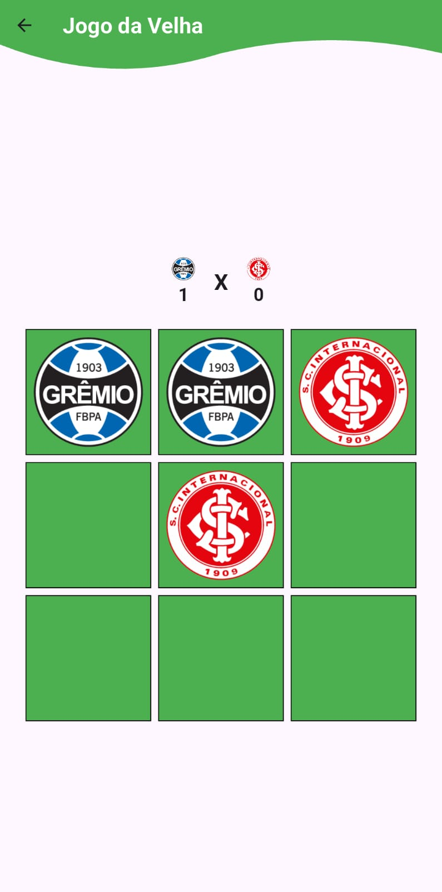
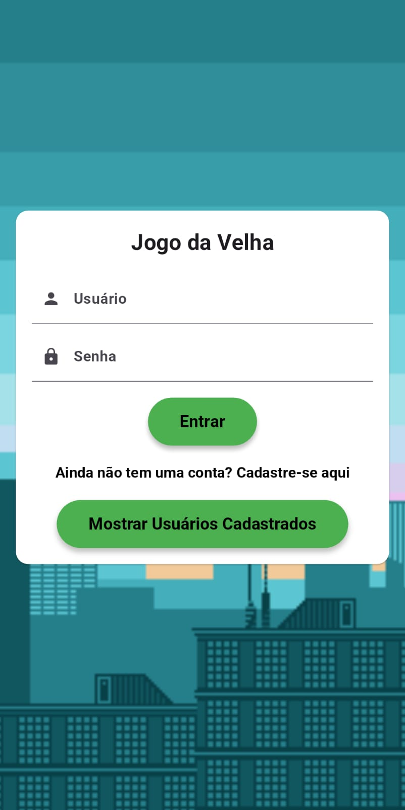

# Jogo da Velha GRENAL - Flutter

Este é um jogo da velha simples implementado em Flutter, com funcionalidades de jogabilidade contra o computador (IA) e placar. A IA pode ser configurada para jogar em diferentes níveis de dificuldade: fácil, médio e difícil. O jogo também salva o placar localmente, permitindo que os jogadores acompanhem os resultados de suas partidas.

## Funcionalidades

- **Placar**: Acompanhe o placar das partidas.
- **Interface simples e intuitiva**: Fácil de jogar com um layout limpo.
- **Lógica de jogo**: Detecta vencedor e empate, além de reiniciar automaticamente após uma partida.

## Como Funciona

1. **Iniciar o Jogo**: O jogo começa com a opção de escolher o nível de dificuldade da IA.
2. **Jogar**: O jogador faz suas jogadas clicando nas células do tabuleiro.
4. **Placar**: O placar é atualizado com base no vencedor da partida.
5. **Reiniciar**: Após o fim de uma partida, o jogo pode ser reiniciado automaticamente.

## Tecnologias Utilizadas

- **Flutter**: Framework utilizado para construir a aplicação mobile.
- **Dart**: Linguagem de programação utilizada para desenvolver a lógica do jogo.
- **DatabaseService (opcional)**: Para salvar e carregar o placar do usuário (utiliza SQLite).

## Screenshots do App

Aqui estão algumas telas do jogo:

